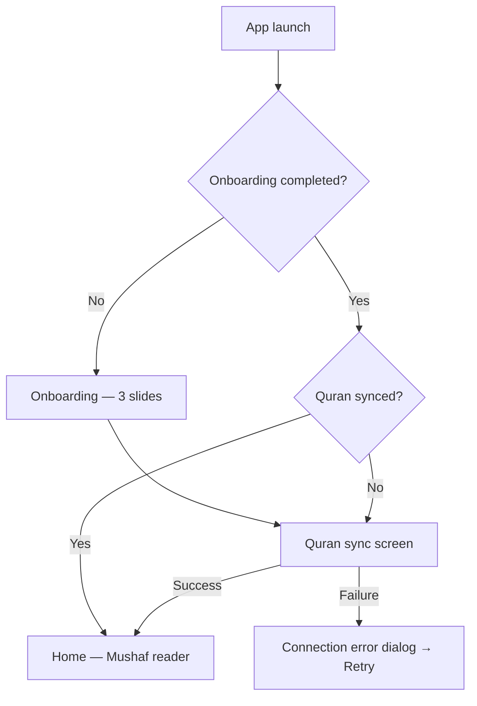

# Qareeb — Product Specification Document

| Field | Value |
|-------|--------|
| **Product** | Qareeb |
| **Version** | 1.0.0+1 |
| **Document status** | Living spec (derived from codebase) |
| **Last updated** | 2026-05-31 |
| **Platforms** | iOS, Android, Web, macOS, Windows, Linux |

---

## Table of contents

1. [Executive summary](#1-executive-summary)
2. [Product purpose & goals](#2-product-purpose--goals)
3. [Target users](#3-target-users)
4. [Product principles](#4-product-principles)
5. [App architecture overview](#5-app-architecture-overview)
6. [User journeys & navigation](#6-user-journeys--navigation)
7. [Feature specifications](#7-feature-specifications)
8. [Settings & personalization](#8-settings--personalization)
9. [Data, APIs & offline behavior](#9-data-apis--offline-behavior)
10. [Localization](#10-localization)
11. [Permissions & device capabilities](#11-permissions--device-capabilities)
12. [Monitoring, feedback & environments](#12-monitoring-feedback--environments)
13. [Non-functional requirements](#13-non-functional-requirements)
14. [Known gaps & spec notes](#14-known-gaps--spec-notes)

---

## 1. Executive summary

**Qareeb** (“قريب” — *near*) is a cross-platform Islamic companion app built with **Flutter**. It helps Muslims read and understand the Quran, track reading progress, perform daily worship (prayer times, Qibla, nearby mosques), and access curated Islamic knowledge (duas, hadith, Asma ul Husna).

The **default home experience** is a **Mushaf-style book reader** (page-by-page Quran layout using official QCF typography). Secondary features are reachable from a **navigation drawer**, organized into Quran, Worship, and Knowledge sections.

---

## 2. Product purpose & goals

### 2.1 Purpose

Provide a single, respectful, offline-capable app that keeps the Quran and core worship tools close at hand — without replacing scholarly authority, but supporting daily practice through clarity, accessibility, and gentle structure.

### 2.2 Primary goals

| Goal | How the product supports it |
|------|------------------------------|
| **Read the Quran regularly** | Mushaf reader, surah/juz navigation, reading progress, bookmarks |
| **Understand verses** | Translations, ayah meanings, word-by-word glosses, AI-assisted ayah stories |
| **Stay on worship schedule** | Prayer times by location, configurable per-prayer notifications |
| **Orient in space** | Live Qibla compass, nearby mosques map with routing |
| **Learn & remember** | Duas by category, searchable hadith collections, 99 Names of Allah |

### 2.3 Non-goals (out of scope for v1)

- Social features, user accounts, or cloud sync of reading progress
- Issuing fatwas or replacing qualified scholars
- Full tafsir library browsing (only per-ayah insight and story content)
- In-app purchases or ads

---

## 3. Target users

| Segment | Needs |
|---------|--------|
| **Daily readers** | Mushaf layout, progress tracking, resume via bookmarks |
| **Learners** | Translation, meanings, word-by-word, audio recitation |
| **Travelers / new residents** | Prayer times, Qibla, nearby mosques |
| **Arabic & non-Arabic speakers** | English, Arabic, Turkish UI; locale-aware Quran content |
| **Accessibility-focused users** | Adjustable app and Quran font scales, light/dark themes |

---

## 4. Product principles

1. **Quran-first** — Home screen is the Mushaf; everything else is one tap away in the drawer.
2. **Offline after setup** — Full Quran text is downloaded once; worship features degrade gracefully without network.
3. **Respectful presentation** — QCF Mushaf fonts, dedicated reader theme, RTL support for Arabic.
4. **Clear feedback** — Loading, error, retry, and empty states on every networked screen.
5. **Privacy by default** — Reading progress stays on device; location used only for worship features.
6. **Clean architecture** — Feature modules with domain / data / presentation layers, BLoC/Cubit state, dependency injection (GetIt).

---

## 5. App architecture overview

### 5.1 Technical stack

| Layer | Technology |
|-------|------------|
| UI | Flutter 3.x, Material 3 |
| State | `flutter_bloc` (Cubit/Bloc) |
| DI | `get_it` |
| Local DB | `drift` (SQLite) — Quran text, reading progress, caches |
| HTTP | `dio` |
| Audio | `just_audio` |
| Maps | `flutter_map` + OpenStreetMap / Overpass |
| Notifications | `flutter_local_notifications` + `timezone` |
| Crash reporting | `sentry_flutter`, `feedback_sentry` |
| Mushaf fonts | `qcf_quran_lite` |

### 5.2 Feature modules

```
lib/
├── core/           # Theme, router, locale, network clients, DI, monitoring
├── features/
│   ├── onboarding/
│   ├── quran/      # Sync, reader, audio, insight, progress
│   ├── home/       # Shell, surah list
│   ├── adhan/      # Prayer times & alerts
│   ├── qibla/
│   ├── nearby_mosques/
│   ├── asma_ul_husna/
│   ├── duaa/
│   ├── hadith/
│   └── settings/
└── l10n/           # ARB → generated AppLocalizations
```

### 5.3 Environments

Configured via `APP_ENV` compile-time flag: **dev**, **staging**, **production**.

Each flavor defines API base URLs, legal/support links, and Sentry DSN. See `lib/core/config/environment.dart`.

---

## 6. User journeys & navigation

### 6.1 Cold start flow



**Onboarding (first launch)**

- Three slides: journey with Quran, understanding verses, staying committed.
- Actions: **Skip**, **Next**, **Get Started** (on last slide).
- Completing onboarding persists a flag and routes to **Quran sync**.

**Quran sync (required before home)**

- Downloads all surahs and ayahs for offline reading (progress % shown).
- On failure: non-dismissible dialog — check connection, **Retry**.
- On success: navigates to **Home shell**.

### 6.2 Primary navigation

| Entry | Destination |
|-------|-------------|
| **Home (default)** | `HomeShellPage` — Mushaf book reader + surah search overlay |
| **Drawer → Surahs** | Surah list → per-surah reader |
| **Drawer → Juz** | 30 juz list → juz reader (Mushaf at juz start page) |
| **Drawer → Quran reciter** | Bottom sheet — select audio edition |
| **Drawer → Adhan** | Prayer times |
| **Drawer → Qibla** | Compass |
| **Drawer → Nearby Mosques** | Map + list |
| **Drawer → 99 Names** | Asma ul Husna |
| **Drawer → Duaa** | Categories → duas |
| **Drawer → Hadith** | Collections, topics, search |
| **Drawer / footer → Settings** | App preferences |

Navigation uses `MaterialPageRoute` pushes (no declarative router package in v1).

---

## 7. Feature specifications

### 7.1 Quran — offline sync

**Purpose:** Ensure the full Quran is available locally before reading.

| Requirement | Behavior |
|-------------|----------|
| Trigger | After onboarding; also on cold start if sync never completed |
| Progress | Percentage indicator |
| Content | Surah metadata + all ayahs (Arabic Uthmani + locale translation) |
| Failure | Connection error dialog with retry |
| Storage | Drift/SQLite via `QuranLocalDataSource` |

**Editions (UmmahAPI identifiers)** — see `QuranEditions`:

| Content | Edition ID |
|---------|------------|
| Arabic text | `quran-uthmani` |
| English translation | `en.sahih` (Saheeh International) |
| Default audio | `ar.alafasy` |
| Word-by-word | `quran-wordbyword-2` |
| Arabic tafsir (insight) | `ar.muyassar` |

---

### 7.2 Quran — Mushaf book reader (home)

**Purpose:** Primary reading experience mimicking a printed Mushaf (604 pages).

#### Layout & interaction

| Gesture / control | Action |
|-------------------|--------|
| **Swipe horizontally** | Turn Mushaf pages (animated page curl–style transition) |
| **Single tap on ayah** | Open **Ayah insight** dialog |
| **Double tap on ayah** | Play audio from that ayah |
| **Long press on ayah** | **Flag/bookmark** ayah (one active flag at a time) |
| **Surah header play** | Play surah audio from first ayah on current page |
| **Search (app bar)** | Filter surahs by name/number; tap result → jump to surah start page |

#### Visual states

- **Read ayahs** — Distinct styling when ayah is marked read in local DB.
- **Flagged ayah** — Flag icon on ayah; FABs: **Go to flagged ayah**, **Remove flag**.
- **Playing ayah** — Highlight during audio playback.
- **Page footer** — Current Mushaf page number.

#### Translation display

- **Arabic locale:** Arabic text only (translation line hidden).
- **English / Turkish:** Arabic + translation below (when `showTranslation` is true).
- Locale changes reload reader via `MushafReaderLocaleListener`.

#### Audio player bar (when playing)

- Surah name, ayah progress (`Ayah X of Y`)
- Play/pause, stop, previous/next ayah (full surah mode)
- Reciter picker shortcut
- Error banner with dismiss (network / missing reciter / load errors)

---

### 7.3 Quran — Surah list & surah reader

**Surah list** (`SurahListPage`)

| Element | Behavior |
|---------|----------|
| Search | By English/Arabic name or surah number |
| Row info | Number, names, ayah count, Makki/Madani, read progress `X/Y read` |
| Tap surah | Opens `AyahReaderPage` (Mushaf layout for single surah, scrollable surah body) |
| Refresh progress | Reloads list when returning from reader |

**Surah reader**

- Same ayah interactions as Mushaf (double-tap audio, long-press flag).
- Surah-level play button in header.
- Audio player bar when active.

---

### 7.4 Quran — Juz navigation

**Juz list** — 30 entries with localized labels and surah count per juz.

**Juz reader** — Opens Mushaf at the **first page** of the selected juz (`JuzReaderPage`).

---

### 7.5 Quran — Ayah insight

**Trigger:** Single tap ayah (from Mushaf or surah reader).

**Dialog sections:**

| Tab / area | Content |
|------------|---------|
| **Meaning** | Ayah translation/meaning (locale-aware via `GetAyahInsight`, cached locally) |
| **Word by word** | Table: Arabic word, transliteration, gloss (`GetAyahWords`; English via UmmahAPI, Turkish via Quran.com API) |
| **Play** | Play ayah audio from dialog (when reader cubit available) |
| **Story** (button) | Bottom sheet with AI-generated content via Pollinations API |

**Ayah story sections** (AI-generated, with loading state):

1. Reason for revelation  
2. How it was revealed to the Prophet ﷺ  
3. Miracle in the verse  

Stories are cached; failures show retry-friendly errors.

---

### 7.6 Quran — Audio recitation

| Requirement | Behavior |
|-------------|----------|
| Reciter selection | Drawer or player bar → bottom sheet listing editions from API |
| Persistence | Selected reciter saved in `SharedPreferences` |
| Playback modes | Single ayah, full surah from page/ayah, sequential ayah advance |
| Caching | Downloaded ayah MP3s cached on disk (`QuranAudioCacheDataSource`) |
| Prefetch | Next ayah prefetched during surah playback |
| Errors | Localized messages: unavailable reciter, network, generic load failure |

---

### 7.7 Quran — Reading progress

**Purpose:** Help users track completion without cloud accounts.

| Capability | Storage | UI |
|------------|---------|-----|
| Per-ayah read state | Drift `reading_progress` | Muted styling for read ayahs in reader |
| Surah aggregate | Derived counts | Surah list: `read/total` label |
| Mark entire surah read | `MarkSurahAsRead` use case | String exists in l10n (`markSurahAsRead`); wired in cubit layer |
| Toggle single ayah read | `ToggleAyahRead` use case | Cubit methods exist; **long press currently maps to flag, not toggle** (see §14) |

Progress is **device-local only**.

---

### 7.8 Adhan — prayer times

**Purpose:** Show accurate prayer times for the user’s city and optional reminders.

#### Location

| Method | Behavior |
|--------|----------|
| **GPS** | Default: resolve current location via `LocationService` |
| **Manual city** | Search sheet — city name or `city, country`; saves selection |
| **Change city** | App bar action on success state |

#### Prayer times display

- **Today’s card** with: Fajr, Sunrise, Dhuhr, Asr, Maghrib, Isha
- **Date picker** — view other days in calendar
- Pull-to-refresh reloads times
- Location label in app bar subtitle

#### Per-prayer alerts

Opened from each prayer row → **alert settings sheet**:

| Setting | Options |
|---------|---------|
| **When** | Off · Before · At adhan · After |
| **Duration** | Minute chips (clamped so alert does not cross adjacent prayer) |
| **Style** | Sound · Vibrate |

Notifications scheduled locally (`PrayerNotificationService`); rescheduled when times or preferences change. Requires notification permission (Android 13+).

#### Error states

- Location denied → prompt to open settings  
- Location services off  
- GPS timeout  
- Plugin not linked (dev/hot-reload message)  
- Generic load failure → retry  

**Data source:** Adhan API via app backend / Ummah integration (`AdhanRemoteDataSource`).

---

### 7.9 Qibla compass

**Purpose:** Show direction to the Kaaba from the user’s position.

| State | Behavior |
|-------|----------|
| **Loading** | Resolve GPS location |
| **Live compass** | Device magnetometer + Qibla bearing; “aligned” when within threshold |
| **No compass sensor** | Static bearing arrow from north + explanatory hint |
| **Info shown** | Bearing (°), offset from Qiblah, cardinal direction, distance to Makkah (km) |
| **Hint** | Hold phone flat and rotate until arrow points up |

Uses `qibla` package + `flutter_compass_v2` + geomagnetic correction where applicable.

---

### 7.10 Nearby mosques

**Purpose:** Find mosques within ~6 km and optionally navigate.

| Element | Behavior |
|---------|----------|
| **Map** | `flutter_map`, user location marker, mosque markers |
| **List** | Sorted by distance (meters or km) |
| **Select mosque** | Highlights marker, loads route |
| **Route** | OSRM-style routing via HTTP; blue polyline on map; ETA and distance when available |
| **Fallback** | Direct line + hint if turn-by-turn routing unavailable |
| **Data** | OpenStreetMap Overpass API (`amenity=mosque`), multiple endpoint failover |
| **Empty / error** | Retry, empty state copy |

Requires **location permission**.

---

### 7.11 Asma ul Husna (99 Names of Allah)

| Element | Behavior |
|---------|----------|
| List | 99 names with Arabic + transliteration |
| Search | By name or meaning |
| Detail | Bottom sheet: name number, meaning |
| Data | Bundled local + remote refresh (`AsmaUlHusna` feature) |

---

### 7.12 Duaa (supplications)

**Navigation:** Categories → duas in category.

| Element | Behavior |
|---------|----------|
| Category list | Search categories |
| Category page | Search duas; count per category |
| Detail sheet | Arabic text, translation, **repeat count**, source reference |
| Data | Local cache + UmmahAPI remote |

---

### 7.13 Hadith

**Collections screen** — two sections:

#### Books (7 canonical collections)

| ID | Collection |
|----|------------|
| `bukhari` | Sahih al-Bukhari |
| `muslim` | Sahih Muslim |
| `abudawud` | Sunan Abu Dawud |
| `tirmidhi` | Jami' at-Tirmidhi |
| `nasai` | Sunan an-Nasa'i |
| `ibnmajah` | Sunan Ibn Majah |
| `malik` | Muwatta Malik |

**Collection page:** Paginated hadith list, search within collection, detail sheet with text + source.

#### Themed sections (topics & curated)

| Category | Type | Search strategy |
|----------|------|-----------------|
| Hadiths about Prayer | Topic | `prayer` |
| Hadiths about Patience | Topic | `patience` |
| Hadiths about Zakat | Topic | `zakat charity` |
| Authentic Hadiths | Curated (Sahih only) | `Prophet` + sahih filter |
| Qudsi Hadiths | Curated | `Allah said` |

**Global search** on collections screen searches across all collections (replaces list with results).

**Data source:** [UmmahAPI Hadith](https://ummahapi.com/api/docs).

---

### 7.14 Onboarding

| Slide | Theme |
|-------|--------|
| 1 | Begin journey with Quran — daily habit |
| 2 | Understand every verse — meanings & tafsir |
| 3 | Stay committed — reminders & progress |

Persist completion → never shown again unless storage cleared.

---

## 8. Settings & personalization

| Setting | Options | Effect |
|---------|---------|--------|
| **Language** | English, Arabic, Turkish | App UI + Quran translation visibility rules |
| **Dark mode** | Light / Dark toggle | `ThemeMode` |
| **App font size** | Slider (~min–max %) | `MediaQuery` text scaler for general UI |
| **Quran reader font size** | Slider | Mushaf Arabic/header scaling |
| **Notifications** | Enable / disable | Master switch for prayer alerts |
| **Clear cache** | Confirm dialog | Removes audio, ayah meanings, word meaning caches |
| **Report a bug** | Sentry feedback overlay | Screenshot + message (when Sentry enabled) |
| **Contact us** | External URL | Support page in browser |
| **Version** | Footer | Package name + version + build |

---

## 9. Data, APIs & offline behavior

### 9.1 External services

| Service | Usage |
|---------|--------|
| **UmmahAPI** | Quran text/editions, hadith, duas, asma, prayer-related data |
| **Qareeb API** (`api.qareeb.app`) | Tafsir proxy, app-specific backends |
| **Quran.com API v4** | Word translations (non-English locales) |
| **Pollinations** | AI ayah stories |
| **OpenStreetMap / Overpass** | Nearby mosques |
| **OSRM / routing endpoint** | Turn-by-turn routes (with fallback) |
| **Sentry** | Crashes, navigation breadcrumbs, user feedback |

### 9.2 Local persistence

| Data | Mechanism |
|------|-----------|
| Quran ayahs & surahs | Drift SQLite |
| Reading progress | Drift |
| Onboarding flag | SharedPreferences |
| Locale, theme, font scales, notifications toggle | SharedPreferences |
| Audio reciter choice | SharedPreferences |
| Ayah insight & story cache | Local data sources |
| Prayer alert preferences | Local data source |
| Saved city / location | Local data source |

### 9.3 Offline matrix

| Feature | Offline after sync |
|---------|-------------------|
| Mushaf reading | ✅ |
| Surah/juz lists | ✅ |
| Reading progress | ✅ |
| Cached audio | ✅ (if previously downloaded) |
| Ayah insight (cached) | ✅ |
| New audio / insight / story | ❌ |
| Hadith / duas (uncached) | ❌ |
| Prayer times refresh | ❌ |
| Qibla (needs location) | ⚠️ Partial |
| Nearby mosques | ❌ |

---

## 10. Localization

| Locale | Code | Quran UI |
|--------|------|----------|
| English | `en` | Arabic + English translation |
| Arabic | `ar` | Arabic only in reader |
| Turkish | `tr` | Arabic + translation; Turkish word glosses |

- Strings: ARB files → `flutter gen-l10n`
- RTL: Supported for Arabic content and drawer chevrons
- Numerals: Arabic-Indic on Arabic surah list
- Prayer names, compass directions, notification copy: fully localized

---

## 11. Permissions & device capabilities

| Permission / capability | Used by |
|-------------------------|---------|
| Internet | Sync, APIs, maps, audio download |
| Fine / coarse location | Adhan, Qibla, nearby mosques |
| Post notifications | Prayer reminders |
| Exact alarm (Android) | Reliable prayer notification scheduling |
| Vibrate | Prayer alerts |
| Boot completed | Reschedule notifications after reboot |
| Compass sensor | Live Qibla (optional) |

---

## 12. Monitoring, feedback & environments

| Capability | Behavior |
|------------|----------|
| **Sentry** | Initialized at startup; `AppBlocObserver` for state errors; navigation observer in non-dev |
| **Bug report** | `feedback_sentry` — screenshot + text → Sentry |
| **Flavors** | `dev`, `staging`, `production` — different API and legal URLs |

---

## 13. Non-functional requirements

### 13.1 Performance

- Mushaf pages lazy-load ayahs per page into cache.
- Page turn animations should remain smooth on mid-range devices.
- Audio prefetch reduces gap between ayahs.

### 13.2 Reliability

- Network calls use timeouts; user-facing retry on critical paths (sync, adhan, hadith).
- Overpass queries failover across multiple endpoints.
- Prayer notification offsets clamped to valid windows between prayers.

### 13.3 Accessibility

- Adjustable font scales (app-wide and Quran-specific).
- Semantic labels on key actions (e.g. hadith list tiles).
- High contrast reader theme separate from app theme.

### 13.4 Security & privacy

- No account system in v1.
- Reading progress not uploaded by default.
- Environment secrets via compile-time `--dart-define` (not committed).

### 13.5 Quality

- Unit/widget tests for critical paths (adhan scheduling, Quran data source, locale, playback).
- `flutter_lints` enforced.
- DCM analysis recommended for Dart quality.

---

## 14. Known gaps & spec notes

Items to align between **product intent** and **current implementation**:

| Item | Spec / l10n intent | Current implementation |
|------|--------------------|-------------------------|
| Long press on ayah | `readAyahHint` says mark as **read** | Long press **flags/bookmarks** ayah |
| `toggleAyahRead` / `markSurahAsRead` | Exposed in cubits + strings | UI wiring incomplete for toggle; mark-surah action not surfaced in reader UI |
| `readAyahHint` | User education string | Not displayed in UI (string unused) |

**Recommendation for next release:** Either wire long-press to `toggleAyahRead` and add a separate bookmark gesture, or update copy and add an explicit “mark read” control in ayah insight.

---

## Appendix A — Drawer information architecture

```
Qareeb
├── Quran
│   ├── Surahs
│   ├── Juz
│   └── Quran reciter
├── Worship
│   ├── Adhan
│   ├── Qibla
│   └── Nearby Mosques
├── Knowledge
│   ├── 99 Names of Allah
│   ├── Duaa
│   └── Hadith
└── Settings (footer on wide drawer; inline on compact)
```

---

## Appendix B — Glossary

| Term | Meaning |
|------|---------|
| **Ayah** | Verse of the Quran |
| **Surah** | Chapter (114 total) |
| **Juz** | One of 30 parts of the Quran |
| **Mushaf** | Physical-layout page view of the Madinah Mushaf |
| **Adhan** | Call to prayer; also used here for prayer *times* |
| **Qibla** | Direction of the Kaaba in Makkah |
| **Hadith** | Narration of the Prophet ﷺ |
| **Duaa / Dua** | Supplication |
| **Asma ul Husna** | The 99 Beautiful Names of Allah |

---

## Appendix C — Document maintenance

When adding or changing features:

1. Update the relevant §7 subsection.
2. Add ARB strings for all user-visible copy.
3. Update §9 if APIs or offline behavior changes.
4. Update §14 if product intent and code diverge.
5. Bump **Last updated** at the top.

---

*This document reflects the Qareeb Flutter codebase as of version 1.0.0+1. For implementation details, refer to `lib/` and `l10n/arb/`.*
